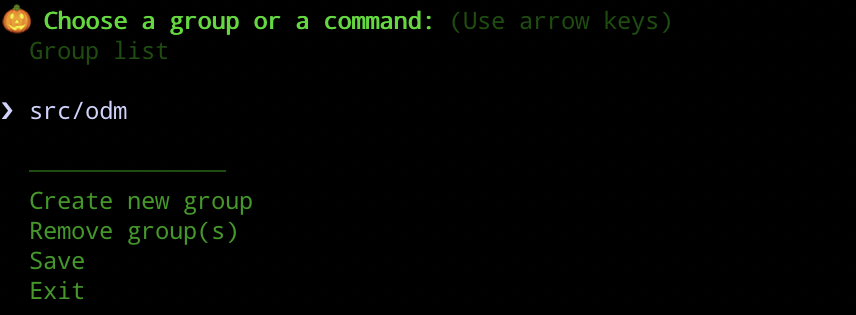

# Mongoose Management Tool [BETA]

## Table of Contents

- [Features](#features)
- [Installation](#installation)
- [Introduction](#introduction)
- [Building](#building)
- [Tests](#tests)
- [Prettier and Lint](#prettier-and-lint)

## Features

- Manage collections for multiple databases
- Manage your schemas via CLI
- Create columns and indexes
- Generate models with full TypeScript support

## Installation

```bash
npm install --global mongoose-management
```

## Introduction

In your project folder you start the application and follow the menu items.

```bash
mongoose-management
```

### Overview of collections groups



### Overview of collections


### Overview of columns and indexes


### Creating a column


## Building

Compile the application from TypeScript to JavaScript.

The following command is available:

- `npm run build`

  Builds the application

## Tests

There are two types of tests:

- **Unit Tests**

  These tests have no dependencies outside the tested file (exception: class inheritance). All dependencies are mocked.

  A test coverage of 100% should be achieved.

- **Integration Tests**

  These tests have no dependencies outside the project. All dependencies in the package.json file are mocked.
  Small libraries, e.g. lodash or luxon, don't need to be mocked.

  A test coverage between 50% and 75% should be achieved.

**The following commands are available:**

| Command                          |    Type     | Description                                     |
| -------------------------------- | :---------: | ----------------------------------------------- |
| `npm run test`                   |    unit     | Run all unit tests                              |
| `npm run test:watch`             |    unit     | Watching mode from unit test                    |
| `npm run coverage`               |    unit     | Creates a coverage report from unit test        |
| `npm run test:integration`       | integration | Run all integration tests                       |
| `npm run test:integration:watch` | integration | Watching mode from integration test             |
| `npm run coverage:integration`   | integration | Creates a coverage report from integration test |

## Prettier and Lint

Ensures that the code is formatted uniformly and that the coding standards are adhered to.

The following commands are available:

- `npm run prettier`

  Changes the code formatting as defined in the Prettier setting.

- `npm run lint`

  Checks if the lint rules are followed. It calls the prettier command first.
