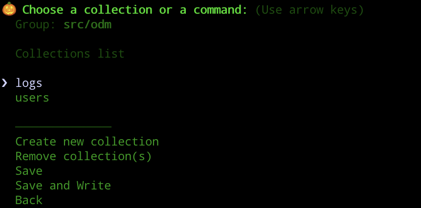
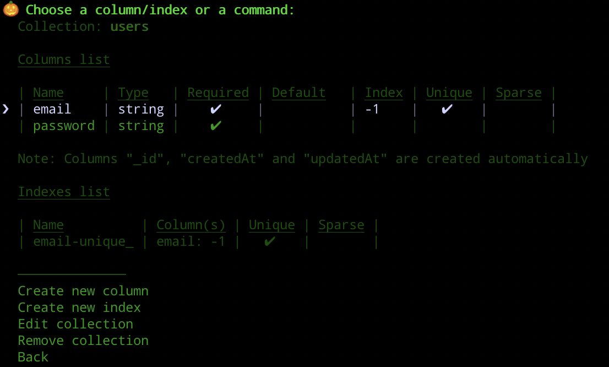
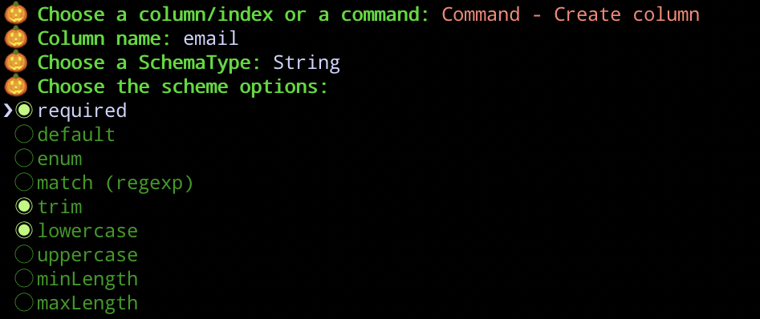

# Mongoose Management Tool

## Table of Contents

- [Features](#features)
- [Installation](#installation)
- [Introduction](#introduction)
- [Building](#building)
- [Tests](#tests)
- [Prettier and Lint](#prettier-and-lint)

## Features

- Manage collections for multiple databases
- Manage your schemas via CLI
- Create columns and indexes
- Generate models with full TypeScript support

## Installation

```bash
npm install --global mongoose-management
```

## Introduction

In your project folder you start the application and follow the menu items.

```bash
mongoose-management
```

The [example folder](./example) contains an example project. With the following command the `mongoose-management` can be started in the context of the example project.

```bash
mongoose-management -p path/to/example/folder
```

### Overview of collections groups


### Overview of collections



### Overview of columns and indexes



### Creating a column



## Building

Compile the application from TypeScript to JavaScript.

The following command is available:

- `npm run build`

  Builds the application

## Tests

**The following commands are available:**

| Command                 | Description               |
| ----------------------- | ------------------------- |
| `npm run test`          | Run all tests             |
| `npm run test:watch`    | Watching mode from test   |
| `npm run test:coverage` | Creates a coverage report |

## Prettier and Lint

Ensures that the code is formatted uniformly and that the coding standards are adhered to.

The following commands are available:

- `npm run prettier`

  Changes the code formatting as defined in the Prettier setting.

- `npm run lint`

  Checks if the lint rules are followed. It calls the prettier command first.
